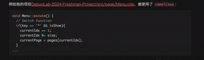

# Typecho-CodeCopyButton

A simple Typecho plugin to add a **copy button** for code blocks.

## Features

You can also try it out on [my blog](https://www.caoxin.xyz).

## Installation

1. Download and rename the folder to `CodeCopyButton`
2. Put it into `usr/plugins/`
3. Enable it in Typecho admin panel

## Usage

Just hover over any code block and click **Copy**.
